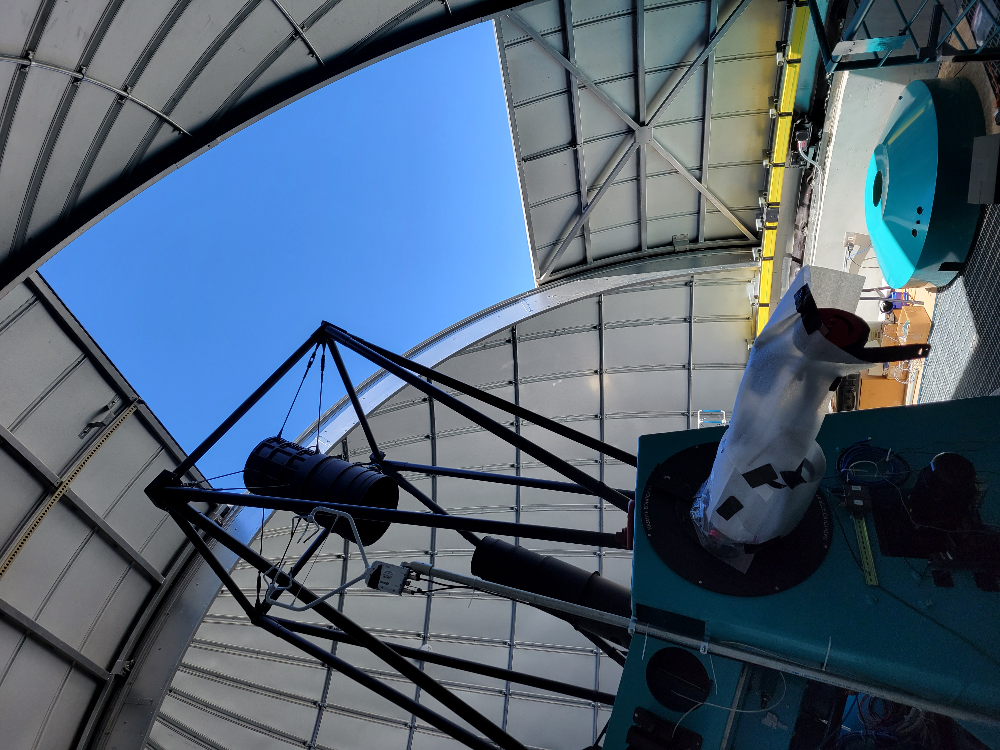

%:tocdepth: 1

.. sectnum::

.. Metadata such as the title, authors, and description are set in metadata.yaml

.. TODO: Delete the note below before merging new content to the main branch.

.. |vspace| raw:: latex

   \vspace{5mm}

Abstract
=================================

This documents how AuxTel mount jitter is impacted by airflow from the fan which ventilates the building, and shows the correlation between mount jitter and accelerometer and anemometer data.

Fan description
=================================

A ventilation fan was installed in the AuxTel dome to aid with bringing the dome into temperature equilibrium with the outside air.  The fan is installed in one of the vent windows on the first floor and blows outward, drawing air into the dome through other openings (other vent windows, the dome slit).  The fan is a 3-phase helicoidal ventilator from Sodeca at https://sodeca.cl . It is model HC-100-6T/H IE3, and at 50Hz frequency it turns at 950 RPM and moves air at 37,000m^3/hr.  It has a variable frequency controller to control the fan speed from 10 Hz to 50 Hz.  There is a small control box to adjust the variable frequency.  When I ran the first two tests below, I made markings on the control box at about 25%, 50%, 75% and 100%, as seen in the image below.  After these tests, a frequency meter was installed to read the frequency (or maybe I just didn't see it the first time).  So on subsequent tests, I used the frequency as the measure of fan speed.  The table below shows the fan speed and air movement at the different settings.  Assuming the fan is exhausting a given volume of air and all of this air is entering through the slit, I made an estimate in the table of the wind speed coming in the slit.

Fan mounted in vent gate window.
Below are the control box (right) and the frequency meter(left).
	    

		

.. image:: ./_static/Fan_table.png
	:width: 99%
	:align: center 

First test 22-Feb-22
==================================

After the fan was installed, it was noticed that it was causing degradation to the image quality and mount jitter.  So a series of tests were run to determine the cause.  One hypothesis was that the fan was causing vibration of the building, which was being transmitted to the telescope mount.  To test this, the fan was ramped up in speed while the other vent windows and the dome slit were closed.  The plots below show that in this condition, the fan speed has no impact on the mount jitter.  So this rules out vibration of the building as the cause of the tracking errors.  Also note that the azimuth oscillation seen in these tests was later understood to be due to a phenomenon called "cogging", which is unrelated to the fan-induced vibrations.

**Fan speed has no impact on moount jitter with slit closed.**

**Azimuth oscillations are due to "cogging" and unrelated to fan speed**

Second test 08-Mar-22
=================================

This test was then repeated with the dome slit open.  The plots below show the mount jitter increasing steadily as the fan speed is increased.  The conclusion is that the mount jitter is caused by turbulent wind buffeting the mount.  The elevation mount jitter is also very similar to that seen when observing during times of high wind speed.

Fan speed at 0%
-----------------------------------------------

Fan speed at 25%
-----------------------------------------------

Fan speed at 50%
-----------------------------------------------

.. image:: ./_static/Mount_Accel_Offset_2022030800025_08Mar22.png

Fan speed at 75%
-----------------------------------------------

Fan speed at 100%
-----------------------------------------------

Summary
-----------------------------------------------

**Summary of impact of fan speed on mount jitter**

Comparison plot of observing jitter caused by wind shake
-----------------------------------------------------------------------

**An image from AuxTel observing with "mount jitter", which looks very similar to the fan-induced errors.  For this image, the wind speed was 10.4 m/s from 323 degrees, and the telescope was pointed at El=58 degrees, Az=241 degrees, so approximately 90 degrees to the wind.**

Third test - 04-Oct-22
=================================

The test was repeated on 04-Oct-22.  By this time the instrumentation was more sophisticated.  A Campbell Scientific 3D sonic anemometer had been introduced to the AuxTel dome, with the data being read into the EFD.  Also, the accelerometer data was now being read into the EFD, where a power spectrum of each of the 9 accelerometers is stored every 2 seconds.  The wind velocity outside the dome was about 35 km/hr on the day of the test, which may have added noise to the measurements.  Because of the wind, the dome slit was only opened to about 50%.  The telescope and dome were aligned to point in the direction of the (fixed) 3D anemometer.  The figure below shows the setup: 

		

**Setup on 04-Oct-22**

These images show the anemometer readings, the accelerometer readings, and the mount encoder data as the fan speed is ramped up:

Measurements with Fan Speed at 0.0 Hz
------------------------------------------------------

   .. image:: ./_static/Accel_PSD_Scaled_20221004T142700Z.png
	:width: 45%
	:align: right 

   .. image:: ./_static/Anemometer_3D_20221004T142700Z.png 
	:width: 45%
	:align: left
	   
   .. image:: ./_static/Mount_Tracking_20221004T142700Z.png
	:width: 45%
	:align: left

   .. image:: ./_static/SectionEnder.png

Measurements with Fan Speed at 10.0 Hz
-------------------------------------------------------

   .. image:: ./_static/Accel_PSD_Scaled_20221004T142900Z.png
	:width: 45%
	:align: right 

   .. image:: ./_static/Anemometer_3D_20221004T142900Z.png 
	:width: 45%
	:align: left
	   
   .. image:: ./_static/Mount_Tracking_20221004T142900Z.png
	:width: 45%
	:align: left

   .. image:: ./_static/SectionEnder.png

Measurements with Fan Speed at 20.0 Hz
--------------------------------------------------------

   .. image:: ./_static/Accel_PSD_Scaled_20221004T143100Z.png
	:width: 45%
	:align: right 

   .. image:: ./_static/Anemometer_3D_20221004T143100Z.png 
	:width: 45%
	:align: left
	   
   .. image:: ./_static/Mount_Tracking_20221004T143100Z.png
	:width: 45%
	:align: left

   .. image:: ./_static/SectionEnder.png

Measurements with Fan Speed at 30.0 Hz
-------------------------------------------------------

   .. image:: ./_static/Accel_PSD_Scaled_20221004T143300Z.png
	:width: 45%
	:align: right 

   .. image:: ./_static/Anemometer_3D_20221004T143300Z.png 
	:width: 45%
	:align: left
	   
   .. image:: ./_static/Mount_Tracking_20221004T143300Z.png
	:width: 45%
	:align: left

   .. image:: ./_static/SectionEnder.png

Measurements with Fan Speed at 40.0 Hz
------------------------------------------------------

   .. image:: ./_static/Accel_PSD_Scaled_20221004T143500Z.png
	:width: 45%
	:align: right 

   .. image:: ./_static/Anemometer_3D_20221004T143500Z.png 
	:width: 45%
	:align: left
	   
   .. image:: ./_static/Mount_Tracking_20221004T143500Z.png
	:width: 45%
	:align: left

   .. image:: ./_static/SectionEnder.png

Measurements with Fan Speed at 50.0 Hz
------------------------------------------------------

   .. image:: ./_static/Accel_PSD_Scaled_20221004T143700Z.png
	:width: 45%
	:align: right 

   .. image:: ./_static/Anemometer_3D_20221004T143700Z.png 
	:width: 45%
	:align: left
	   
   .. image:: ./_static/Mount_Tracking_20221004T143700Z.png
	:width: 45%
	:align: left

   .. image:: ./_static/SectionEnder.png

Summary of measurements
-----------------------------------------------

   .. image:: ./_static/Joint_Ane_Accel_Mount_Tests_04Oct22.png

This is a summary of the measurements taken.  The anemometer standard deviation, the total accelerometer power, and the mount jitter all ramp up as the fan speed is increased.

Power spectrum of elevation errors
-----------------------------------------------------------

Also, I looked at the power spectrum of the elevation mount errors.  The power is all under 10 Hz:

   .. image:: ./_static/Elevation_Error_Power_Spectrum_04Oct22.png
	   
Search for understanding of accelerometer PSD peaks
=======================================================================

The accelerometer power spectra typically show some peaks.  This describes an attempt to understand those peaks.  First, below is a quiescent (afternoon, dome closed and empty) power spectrum on 29-Sep-22.  The primary peaks are seen around 10 Hz and around 70Hz.  What causes those peaks?

A similar spectrum is seen on 04-Oct-22.  There are also peaks at around 50Hz.  This could be 50Hz AC pickup, but it only affects some channels.

I hypothesized that the higher frequency peak around 70 Hz could be a stretching  oscillation along the length of the mount struts.  By banging on the end of the strut, I could excite this mode, as shown below.  Note the scale has been increased by a factor of 100:

Banging on the side of the strut to excite some kind of bending mode was less successful, and seemed to excite a wide range of frequencies:

Anemometer move - 22-Nov-22
=================================

Having the anemometer mounted at a fixed point in the dome proved to be not very useful.  So we moved the anemometer so that it was mounted on the telescope fork (see photo below). This way it is much closer to seeing the wind environment that the telescope sees.  At about the same time, the CSC was changed so that was is strored in the EFD, instead of being a stream of wind speeds, is the mean and standard deviation of the measurements every minute.  The above set of tests was repeated twice in the new configuration.

	   
Fourth test - 23-Nov-22
=================================

The tests were repeated on 23-Nov-22.  The wind velocity outside the dome as measured by the Gemini weather station was 3.6 m/s from 302 degrees.  The slit was only about 50% open to prevent the sun from falling on the telescope.  The telescope and dome were aligned to 180 degrees.  The figure below shows the setup: 

		

**Setup on 23-Nov-22**

These images show the anemometer readings, the accelerometer readings, and the mount encoder data as the fan speed is ramped up:

Measurements with Fan Speed at 0.0 Hz
------------------------------------------------------

   .. image:: ./_static/Accel_Anemom_Mount_2022112300018.png

Measurements with Fan Speed at 10.0 Hz
------------------------------------------------------

   .. image:: ./_static/Accel_Anemom_Mount_2022112300023.png

Measurements with Fan Speed at 20.0 Hz
------------------------------------------------------

   .. image:: ./_static/Accel_Anemom_Mount_2022112300028.png

Measurements with Fan Speed at 30.0 Hz
------------------------------------------------------

   .. image:: ./_static/Accel_Anemom_Mount_2022112300033.png

Measurements with Fan Speed at 40.0 Hz
------------------------------------------------------

   .. image:: ./_static/Accel_Anemom_Mount_2022112300038.png

Measurements with Fan Speed at 50.0 Hz
------------------------------------------------------

   .. image:: ./_static/Accel_Anemom_Mount_2022112300043.png

Summary of measurements
-----------------------------------------------

   .. image:: ./_static/Anemom_vs_Fan_Speed_23Nov22.png
	      
   .. image:: ./_static/Joint_Ane_Accel_Mount_Tests_23Nov22.png

This is a summary of the measurements taken.  The total accelerometer power, and the mount jitter all ramp up as the fan speed is increased. All of the anemometer standard deviations increase as the fan speed is ramped, indicating increased turbulence.  In addition, the Uz mean speed also increases.  The anemometer readings show much more scatter than expected.

Fifth test - 28-Nov-22
=================================

The tests were repeated on 28-Nov-22.  The wind velocity outside the dome as measured by the Gemini weather station was 3.4 m/s from 325 degrees.  By positioning the telescope and dome to 230 degrees, I was able to open the slit somewhat further without the sun falling on the telescope.  The figure below shows the setup: 

		

**Setup on 28-Nov-22**

These images show the anemometer readings, the accelerometer readings, and the mount encoder data as the fan speed is ramped up:

Measurements with Fan Speed at 0.0 Hz
------------------------------------------------------

   .. image:: ./_static/Accel_Anemom_Mount_2022112800003.png

Measurements with Fan Speed at 10.0 Hz
------------------------------------------------------

   .. image:: ./_static/Accel_Anemom_Mount_2022112800008.png

Measurements with Fan Speed at 20.0 Hz
------------------------------------------------------

   .. image:: ./_static/Accel_Anemom_Mount_2022112800013.png

Measurements with Fan Speed at 30.0 Hz
------------------------------------------------------

   .. image:: ./_static/Accel_Anemom_Mount_2022112800018.png

Measurements with Fan Speed at 40.0 Hz
------------------------------------------------------

   .. image:: ./_static/Accel_Anemom_Mount_2022112800023.png

Measurements with Fan Speed at 50.0 Hz
------------------------------------------------------

   .. image:: ./_static/Accel_Anemom_Mount_2022112800028.png

Summary of measurements
-----------------------------------------------

   .. image:: ./_static/Anemom_vs_Fan_Speed_28Nov22.png
	      
   .. image:: ./_static/Joint_Ane_Accel_Mount_Tests_28Nov22.png

This is a summary of the measurements taken.  The total accelerometer power, and the mount jitter all ramp up as the fan speed is increased. All of the anemometer standard deviations increase as the fan speed is ramped, indicating increased turbulence.  In addition, the Uz mean speed also increases.  The anemometer readings show much more scatter than expected.

Conclusions
=================================

This report is somewhat of a "data dump", with a lot of data that is difficult to interpret.  One consistent finding in all of the tests is that the mount jitter increases steadily as the fan speed is increased.  For this reason, it is not recommended to go above 20 Hz on the frequency meter when observing.  We should discontinue use of the hand written (25%-50%-75%) markings on the speed adjustment and use instead the frequency meter, which is much more accurate.  The accelerometer and anemometer readings are qualitatively consistent with increasing wind turbulence and mount shake as the wind speed is increased, but it is difficult to draw any quantitative conclusions from these readings. One clear result is that the anemometer standard deviations increase consistently as the fan speed is increased, indicating increased turbulence.  I am open to suggestions as to further measurements or analysis.

..    :style: lsst_aa
